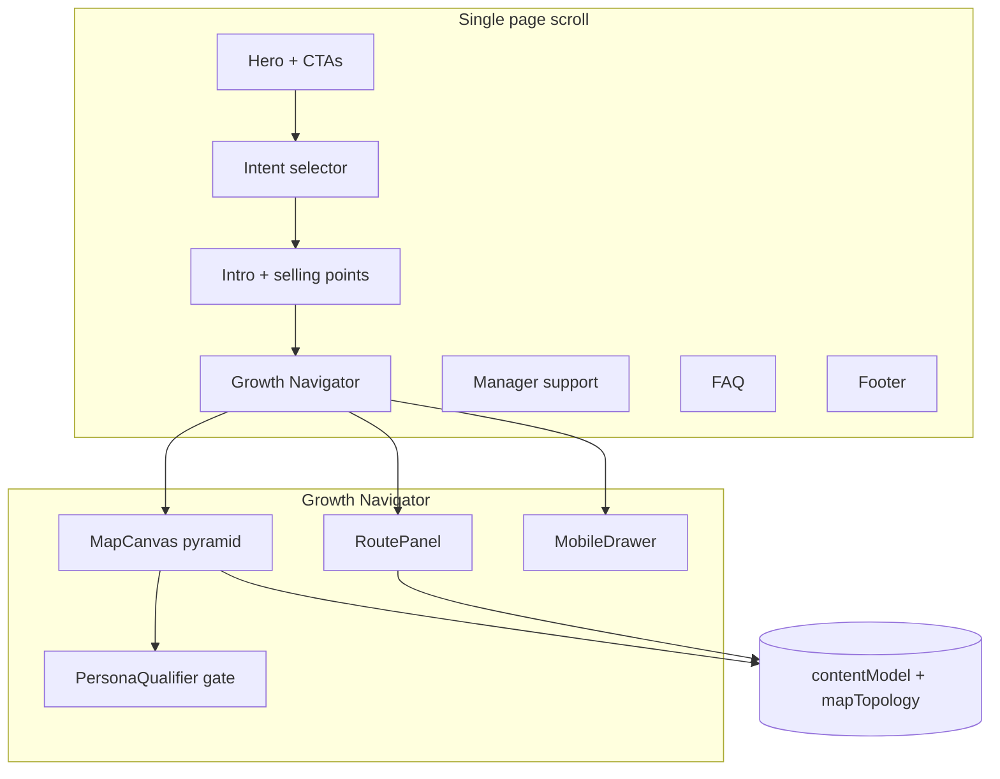

# Room to Grow — IHG Growth Navigator: Comprehensive Site Rundown

This document is an exhaustive description of the **room-to-grow** front-end application: what it is, how it is built, how pages and features work, what data drives them, and what is intentionally unused or placeholder.

---

## 1. Project identity

| Item | Detail |
|------|--------|
| **Working name** | `room-to-grow` (npm package) |
| **Product framing** | IHG **Room to Grow** campaign + **IHG University** / **Growth Navigator** interactive wireframe |
| **Document title** | `Room to Grow \| IHG Growth Navigator` ([`index.html`](index.html)) |
| **Architecture** | Single-page application (SPA), **no client-side router** — one vertical scroll experience |
| **Backend** | **None** in this repo. All content is static/mock data in [`src/data/contentModel.js`](src/data/contentModel.js). No API calls, auth, or persistence |

---

## 2. Technology stack

| Layer | Choice |
|-------|--------|
| **Runtime / UI** | React **19** ([`package.json`](package.json)) |
| **Bundler** | Vite **5** with `@vitejs/plugin-react` ([`vite.config.js`](vite.config.js)) |
| **Styling** | **Tailwind CSS 3** ([`tailwind.config.js`](tailwind.config.js), [`src/index.css`](src/index.css)) — utility classes throughout components |
| **Language** | JavaScript (JSX), **no TypeScript** in source (only `@types/*` dev deps) |
| **Linting** | ESLint 9 + `eslint-plugin-react-hooks`, `eslint-plugin-react-refresh` ([`eslint.config.js`](eslint.config.js)) |

### NPM scripts

- `npm run dev` — Vite dev server with HMR  
- `npm run build` — production build to `dist/`  
- `npm run preview` — serve production build locally  
- `npm run lint` — ESLint on project  

### Entry points

- [`index.html`](index.html) — mounts `
`, loads [`src/main.jsx`](src/main.jsx)  
- [`src/main.jsx`](src/main.jsx) — `createRoot`, `StrictMode`, imports global CSS and [`App.jsx`](src/App.jsx)  

---

## 3. Global layout and visual system

- **Root shell** ([`App.jsx`](src/App.jsx)): `min-w-0`, `overflow-x-hidden`, `bg-gray-50`, `text-gray-800`  
- **Header** is **sticky** (`z-50`) with simple brand placeholders: “IHG University”, “Room to Grow”, “Help / FAQ” (non-functional text on the right)  
- **Typography / colour**: neutral grays, white cards, blue accents for “advanced” / diploma affordances and links  
- **Responsive**: heavy use of `md:` breakpoints; Growth Navigator uses **split layout on desktop** (map + sidebar) and **drawer + floating button on mobile**  
- **Favicon** ([`index.html`](index.html)): `/favicon.svg` (from `public/` if present)  

[`src/index.css`](src/index.css) adds `overflow-x: hidden` on `html`, `body`, `#root`, and hides scrollbars on carousels using `#selling-points-carousel` and `.programme-explorer-carousel` (class hooks for potential carousels).

---

## 4. Page structure (top to bottom)

The main content is a **single column** inside `<main>` in [`App.jsx`](src/App.jsx). Refs are used for smooth scrolling: `intentSectionRef`, `orientationRef`, `navigatorRef`.

### 4.1 Header — [`src/components/Header.jsx`](src/components/Header.jsx)

- Fixed-height sticky bar  
- No navigation menu or routing — purely presentational labels  

### 4.2 Hero — [`src/components/HeroVideoSection.jsx`](src/components/HeroVideoSection.jsx)

- Large hero region with minimum height (`min-h` using `vh` caps)  
- **Copy** from [`strapline`](src/data/contentModel.js): headline + intro paragraph  
- **Buttons**  
  - *Start Exploring* → `onStartExploring` → scrolls to **Intent selector**  
  - *I'm developing my team* → `onLeaderMode` → sets `leaderMode` state to `true` and scrolls to **Growth Navigator** (`#growth-navigator`)  
- **Play button** — decorative (no `onClick` / no video player wired)  

### 4.3 Intent selector — [`src/components/IntentSelector.jsx`](src/components/IntentSelector.jsx)

- Driven by [`intentSelector`](src/data/contentModel.js): question, microcopy, three options  
- **Values** (string tokens passed to `onSelectIntent`):  
  - `selfGrowth` → scroll to Growth Navigator  
  - `developingTeam` → `setLeaderMode(true)` + scroll to Growth Navigator  
  - `learnAbout` → scroll to **Intro / orientation** block (`IntroSection` inside `Container`)  

### 4.4 Intro / orientation — [`src/components/IntroSection.jsx`](src/components/IntroSection.jsx)

- Uses [`introBlock`](src/data/contentModel.js) for campaign / IHG University messaging  
- Wrapped in [`Container`](src/components/Container.jsx) for max-width / horizontal padding  

### 4.5 Selling points — [`src/components/SellingPointsGrid.jsx`](src/components/SellingPointsGrid.jsx)

- Renders [`sellingPoints`](src/data/contentModel.js) as a grid of value bullets  

### 4.6 Growth Navigator — **core interactive section** (`#growth-navigator`)

See **Section 5** for full behaviour. Visually:

- Bordered rounded “frame” (`max-w-[1800px]` on large screens)  
- **Left (flex-1)**: optional “Tailored for you” strip when `selectedPersonaId` is set; **MapCanvas**; mobile **“Search & filters”** button  
- **Right (md+)**: fixed-width aside (`w-96`, scrollable) with **RoutePanel**  
- **Below md**: **MobileDrawer** slides up with NavigatorControls + RoutePanel  

### 4.7 Manager support — [`src/components/ManagerSupportSection.jsx`](src/components/ManagerSupportSection.jsx)

- Two columns: [`managerGuidance`](src/data/contentModel.js) (bullets) and [`leaderActionSteps`](src/data/contentModel.js) (numbered list)  
- Static copy; `leaderMode` from App is **not** used to change this section’s content  

### 4.8 FAQ — [`src/components/FAQSection.jsx`](src/components/FAQSection.jsx)

- Accordion from [`faqs`](src/data/contentModel.js)  
- Section id `faq` for footer link  

### 4.9 Footer — [`src/components/Footer.jsx`](src/components/Footer.jsx)

- Links: `#faq`, `#accessibility`, `#privacy`, `#legal` — **placeholders** (no matching section ids except `faq`)  

---

## 5. Growth Navigator — deep dive

### 5.1 Purpose

A **guided pyramid map** of:

1. **Hotel roles** (bottom tier)  
2. **Core “Journey to …” programmes** (middle tier)  
3. **Hospitality Leadership diplomas** (top tier — “value add”)  

Users pick a **current role**, see **soft-suggested** paths, then **commit** to a **core** or **advanced** node; the **sidebar** mirrors selection with role overview vs programme detail.

### 5.2 Application state ([`App.jsx`](src/App.jsx))

| State | Type / role |
|-------|-------------|
| `userContext` | `{ currentRoleId, mapMode } \| null` — anchor role + `MAP_MODE.startNow` or `exploreNext` |
| `selectedNodeId` | Primary selected map/panel node id |
| `selectedNodeType` | `null` \| `"role"` \| `"core"` \| `"advanced"` |
| `selectedProgrammeId` | Legacy/alternate id; cleared on map flows; `RoutePanel` uses `selectedProgrammeId \|\| selectedNodeId` as `activeNodeId` |
| `selectedStoryId` | When set, RoutePanel shows **story** card (see [`stories`](src/data/contentModel.js)) |
| `selectedPersonaId` | Persona from qualifier; merged into `userContext` spread for children |
| `mobileDrawerOpen` | Mobile drawer visibility |
| `timeFilter` | `"10 minutes"` … `"Longer learning"` — UI state in NavigatorControls |
| `leaderMode` | Set from hero / intent; **passed to RoutePanel but not used** (prefixed discard in panel) |
| `aiFocus` | `{ nodeIds?, connectorIds? } \| null` — for MapCanvas emphasis; **cleared** on map selection; **RoutePanel receives `onAiFocusChange` but does not call it** (reserved for future AI UI) |

`userContext.selectedPersonaId` is **not** stored inside `userContext` in state — it is **spread at render** as `{ ...userContext, selectedPersonaId }` when passed to MapCanvas / RoutePanel.

### 5.3 Derived map interaction (`mapInteractionState`)

Computed with `useMemo`:

- **`idle`** — no `selectedRoleId` (`userContext?.currentRoleId`)  
- **`role_selected`** — anchor role set and `selectedNodeType === "role"`  
- **`node_selected`** — `selectedNodeType` is `core` or `advanced`  

### 5.4 Derived highlight sets (passed to MapCanvas)

| Prop | Meaning |
|------|---------|
| `highlightedNodeIds` | Nodes that stay prominent (suggest set from role, or committed path + support nodes) |
| `highlightedConnectionIds` | **Dashed** “relevant routes” for anchor role (`getRelevantPathsForRole`) in both role and node selected modes |
| `activeConnectionIds` | **Solid** path from anchor to selected programme (`getConnectionsForSelection`) |
| `softConnectionIdsForCommit` | Extra **dashed** core path when a **diploma** is selected (`getCommittedSoftConnectionIds`) |
| `mapInteractionState` | `idle` \| `role_selected` \| `node_selected` |

Persona hook: `intersectSuggestNodesWithPersona` currently returns the list unchanged (stub for future narrowing).

### 5.5 Event handlers

- **`handleMapNodeSelect(nodeId)`**  
  - Clears story, programme id, AI focus; opens mobile drawer  
  - **Role**: sets `userContext`, `selectedNodeId`, `selectedNodeType = "role"`, `mapMode = exploreNext`  
  - **Programme**: resolves anchor (`currentRoleId` or `inferAnchorRoleForProgramme`), optionally re-infers if BFS path empty, sets context + `selectedNodeType` from `programme.type`  

- **`handleNavigatorRoleChange(roleId)`**  
  - Empty value: clears `userContext`, `selectedNodeId`, `selectedNodeType`  
  - Otherwise: same as selecting that role on the map (exploreNext + role panel)  

- **`handleTimeFilterChange`** — updates `timeFilter`; if role exists, sets `mapMode` to `startNow` and opens drawer  

- **`handleSelectStory` / `handleSelectProgramme`** — story vs programme selection paths (programme aligns anchor like map select); open drawer  

### 5.6 Map canvas — [`src/components/MapCanvas.jsx`](src/components/MapCanvas.jsx)

**Grid model (9 columns)**

- **Top row**: diplomas `hospitality_diploma_3`, `_4`, `_5` at columns 3, 5, 7  
- **Middle row**: journeys `journey_supervisor`, `journey_manager`, `journey_senior_manager`, `journey_gm` at 2, 4, 6, 8  
- **Bottom row**: roles `frontline`, `supervisor`, `manager`, `senior_manager`, `general_manager` at 1, 3, 5, 7, 9  

**Edges** — imported from [`src/data/mapTopology.js`](src/data/mapTopology.js) as `MAP_CONNECTORS`:

- **`core`** — main progression ladder (role → journey → next role, etc.)  
- **`diplomaPath`** — role → diploma → next role  
- **`fallback`** — journey → previous role (backward); styled faint; not used in BFS path selection  

**SVG connectors** between node anchors (`ResizeObserver` + `getBoundingClientRect`):

1. **AI focus** (if `aiFocus` matches) — blue / animated dash  
2. **Active** — solid, strong (selected path)  
3. **Highlighted** — dashed, medium (suggested routes not on active path)  
4. **Structural baseline** — all other core/diploma edges remain **visible** at readable grey weight so the full pyramid stays legible  

**Persona gate**

- If **no** `userContext` and **no** `selectedPersonaId`, **PersonaQualifier** is shown centered over a dimmed map (`opacity-0.3` on wrapper)  
- After persona (or if `userContext` exists), map is fully interactive  

**Map nodes** — [`RouteNode`](src/components/RouteNode.jsx) inside square tiles:

- States: `current` (matches `userContext.currentRoleId`), `selected`, `future`  
- Opacity / rings driven by highlights, AI focus, “past” roles in explore mode (`getPastRoleIds`), soft diploma suggest  
- **No** separate “Next step” CTA under roles (removed); label is the role name from content model  

**Map click** — calls `onSelectMapNode` + `openDrawer` on mobile pattern.

### 5.7 Sidebar / route panel — [`src/components/RoutePanel.jsx`](src/components/RoutePanel.jsx)

**Routing logic (by priority)**

1. If `selectedStoryId` → story card (placeholder image from placehold.co) or empty fallback  
2. Else if role selected (`activeRole` + `effectiveType === "role"`) → **RoleOverviewPanel**  
3. Else if core programme → **CoreProgrammePanel**  
4. Else if advanced programme → **AdvancedProgrammePanel**  
5. Else → **EmptyPanel**  

`effectiveType` prefers `selectedNodeType`; otherwise infers from programme `type` or role.

**Role overview**

- Title, overview excerpt, “Available next steps”, “Suggested learning options” (bullets)  
- **Progress on the map**: buttons only for **core journey** and **diploma** (not other role tiles)  
- **`onActivateNode`** = same as map select (`handleMapNodeSelect`)  

**Core programme panel**

- Structured fields: who it’s for, skills, what to expect, time, next step  
- **Progress on the map**: this programme + optional diploma for anchor role  
- **CoreAiSupportBlock** — static prompt buttons (no handlers wired to `askPathAi`)  

**Advanced programme panel**

- Value-add copy, quote, “Recommended for progression”, **AdvancedAiSupportBlock** with deterministic `buildDevelopmentCase` / `getAdvancedConversationGuidance` (no network)  
- **Progress on the map**: this diploma + optional core journey for anchor  
- Diploma sidebar buttons use **`variant="diploma"`** (blue styling) on **MapNavButton**  

**Empty panel**

- **No anchor role**: intro copy + **Hotel roles** — all five `MapNavButton`s  
- **Anchor role set** (e.g. from filters) but no programme/role panel: **Progress options** (journey + diploma) + **`
`** “Choose a different role” listing **other** roles only  

**Shared UI**

- `MapNavButton` — default (gray) vs `variant="diploma"` (blue); **active** state when selection matches node + type  
- `onClose` only in **mobile** drawer RoutePanel  

### 5.8 Mobile drawer — [`src/components/MobileDrawer.jsx`](src/components/MobileDrawer.jsx)

- `fixed` overlay, `md:hidden` usage implied by App (drawer always rendered but only meaningful on small screens when opened)  
- Backdrop click closes  
- Bottom sheet, `max-h-[70vh]`, scrollable  
- Contains **NavigatorControls** + **RoutePanel**  

### 5.9 Navigator controls — [`src/components/NavigatorControls.jsx`](src/components/NavigatorControls.jsx)

- `<select>` of all **roles** synced to `userContext.currentRoleId`  
- Time radios (10m / 30m / 1h / Longer)  
- Helper copy about map + “start learning now”  

---

## 6. Data model — [`src/data/contentModel.js`](src/data/contentModel.js)

Central **mock CMS**. Key exports:

### 6.1 Marketing / static copy

- `strapline`, `introBlock`, `intentSelector`, `sellingPoints`  
- `managerGuidance`, `leaderActionSteps`  
- `pathAiConfig` (titles/prompts — not fully wired to UI)  
- `faqs`  

### 6.2 Roles — `roles[]`

Each: `id`, `level` (0–4), `label`, `overview`, `quote`, `quoteAuthor`.

Ids: `frontline`, `supervisor`, `manager`, `senior_manager`, `general_manager`.

### 6.3 Personas — `personas[]`, `personaQualifyingQuestions[]`

Five personas with `panelFocusSelf` / `panelFocusLeader` (used in `buildDevelopmentCase` and path AI context). Qualifier maps **goal question** answers to `personaId` without exposing persona names in the question.

### 6.4 Programmes — `programmes[]`

- **`type`**: `"core"` or `"advanced"`  
- **Journeys** (on map): `journey_supervisor`, `journey_manager`, `journey_senior_manager`, `journey_gm`  
- **Diplomas** (on map): `hospitality_diploma_3`, `_4`, `_5`  
- **Not on map** (data only): e.g. `core_leadership`, `leadership_diplomas` — no edges in `MAP_CONNECTORS`; selecting them via hypothetical UI would need anchor inference (may fail if no incoming edge)  

Fields commonly used in UI: `title`, `whoItsFor`, `skillsDeveloped`, `whatToExpect`, `timeCommitment`, `nextStep`, `whyChooseThis`, `quote`, `quoteAuthor` (advanced).

### 6.5 Stories — `stories[]`

Example colleague narratives; `handleSelectStory` can show them in RoutePanel (no in-app triggers from main map in current App.jsx).

### 6.6 Role → programme mappings (internal)

- `coreJourneyByRoleId` — one core journey per hotel role (except GM has `journey_gm`)  
- `diplomaByRoleId` — supervisor → L3, manager → L4, senior_manager → L5 diploma; frontline/GM have no diploma in map data  

### 6.7 Map helper functions (exported)

Includes: `getNextRoleById`, `getCoreJourneyForRole`, `getDiplomaForRole`, `getRelevantPathsForRole`, `getConnectionsForSelection`, `getSupportingHighlightsForAdvanced`, `inferAnchorRoleForProgramme`, `getSuggestHighlightNodeIds`, `getCommittedHighlightNodeIds`, `getCommittedSoftConnectionIds`, `intersectSuggestNodesWithPersona`, `getPastRoleIds`, `getActivePathState`, `getRelevantNodes`, `getForwardConnectorIdsForFocus`, `getNodeContext`, `getProgrammeById`, `getRoleById`, `getStoryById`, `buildDevelopmentCase`, `getAdvancedConversationGuidance`, `ADVANCED_CONVERSATION_PROMPT_IDS`, `MAP_MODE`, re-export **`MAP_CONNECTORS`**.

---

## 7. Map topology — [`src/data/mapTopology.js`](src/data/mapTopology.js)

Single export: **`MAP_CONNECTORS`** — array of `{ id, fromId, toId, type }`.

- **`id`** — stable string key, often `from->to`  
- **Forward path BFS** uses only `core` + `diplomaPath`  
- **`fallback`** edges exist for visual structure / legacy styling; not part of shortest-path selection  

---

## 8. Path AI module — [`src/data/pathAi.js`](src/data/pathAi.js)

- **`buildPathAiContext`** — merges `userContext` with `mapMode: exploreNext` for `getActivePathState`, returns role labels + selected node label  
- **`askPathAi`** — **deterministic** canned responses by `classifyIntent` / `getNodeLean`; applies `applyGuardrails`; returns `focus` `{ nodeIds, connectorIds, tag }` for potential map highlighting  
- **`PATH_AI_SYSTEM_PROMPT`** — template string for hypothetical LLM integration  

**Not connected** from RoutePanel buttons or MapCanvas in the current tree; `aiFocus` in App is only useful if something calls `setAiFocus` with the shape `askPathAi` returns.

---

## 9. Components present but **not** imported by `App.jsx`

These files exist under `src/components/` but are **orphans** relative to the live page (useful for prototypes or future wiring):

| File | Likely purpose |
|------|----------------|
| [`ProgrammeCards.jsx`](src/components/ProgrammeCards.jsx) | Programme grid + `onSelectProgramme` |
| [`RouteSummaryBar.jsx`](src/components/RouteSummaryBar.jsx) | Summary strip |
| [`StoryPin.jsx`](src/components/StoryPin.jsx) | Story entry points |
| [`TimeFilter.jsx`](src/components/TimeFilter.jsx) | Standalone time control |
| [`PersonaToggle.jsx`](src/components/PersonaToggle.jsx) | Persona switcher |
| [`NavigatorSearchBar.jsx`](src/components/NavigatorSearchBar.jsx) | Search UI |

[`SITE-BREAKDOWN.md`](SITE-BREAKDOWN.md) in the repo may describe an alternate or earlier IA; the **running app** follows `App.jsx` as above.

---

## 10. Container and small utilities

- [`Container.jsx`](src/components/Container.jsx) — horizontal padding / max-width wrapper for marketing sections  
- [`RouteNode.jsx`](src/components/RouteNode.jsx) — circular step indicator + label button for map and any chain UIs  

---

## 11. Assets and third-party references

- **Images**: Story panel uses `https://placehold.co/...`; quotes use `https://ui-avatars.com/api/...` in RoutePanel  
- **Video**: Hero play control is non-functional  
- **Footer**: Several `href` targets have no implementation  

---

## 12. Accessibility and semantics (high level)

- Sections use `aria-label` / `aria-labelledby` where components define them (hero, intent, manager support, etc.)  
- Map SVG is `pointer-events-none`; interaction is on HTML buttons (`RouteNode`)  
- Mobile drawer uses `role="dialog"` and close control  
- Route nodes use `aria-pressed` where implemented in `RouteNode`  

A full audit (contrast, focus order, keyboard map navigation) is **not** documented here as code-level truth.

---

## 13. Deployment / environment

- Typical **static hosting** (e.g. Netlify, Vite preview): build output is static files  
- No env vars required for core behaviour in this repo  

---

## 14. Mental model summary

**Interaction summary**

1. Optional **persona** → unlocks map emphasis.  
2. **Role** selection (map, sidebar, or dropdown) → **suggest** state: dashed relevant routes, role overview in panel.  
3. **Programme** selection → **commit** state: solid path to node, faded non-path nodes, programme panel (core vs advanced).  
4. **Sidebar** duplicates map targets via `onActivateNode` with **blue** styling for diploma links.  

---

*Generated to reflect the repository as of the documentation authoring; if the codebase drifts, update this file or regenerate from source.*
